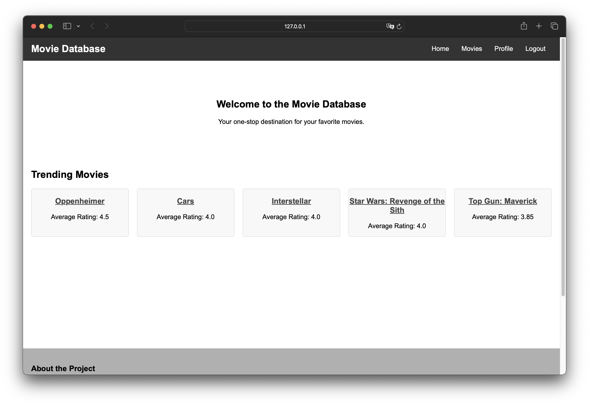
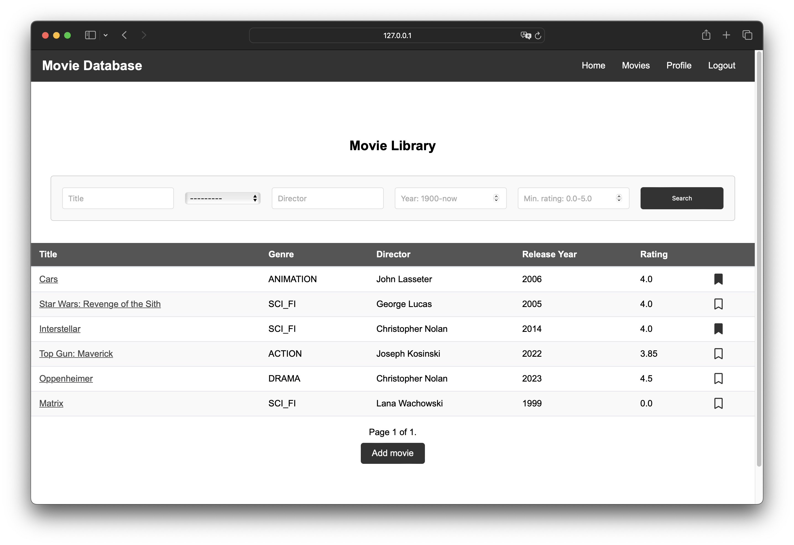
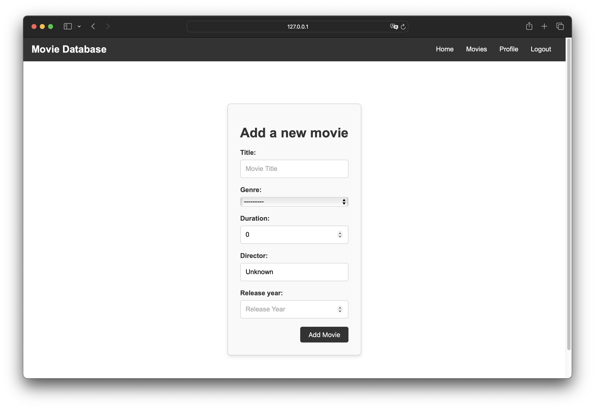
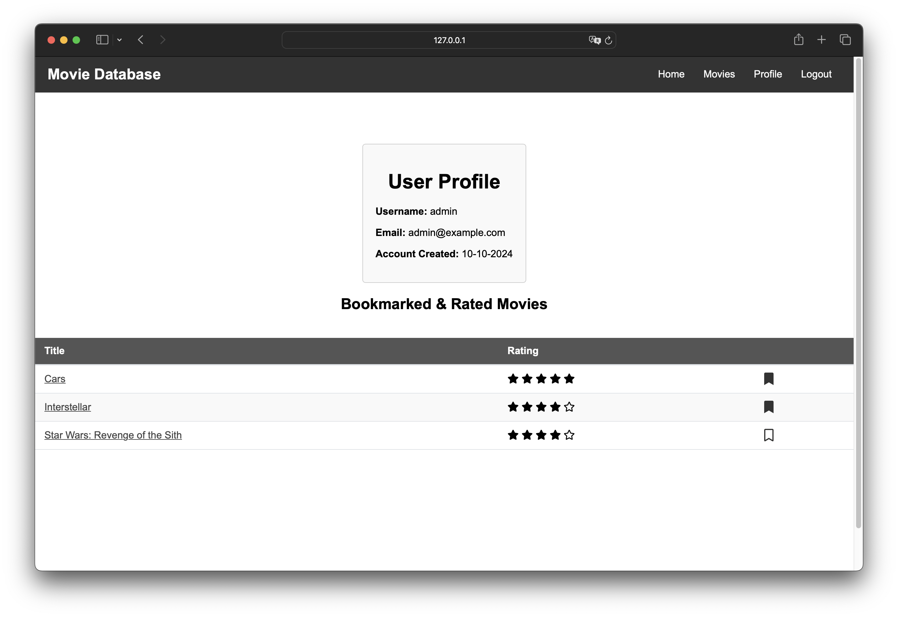
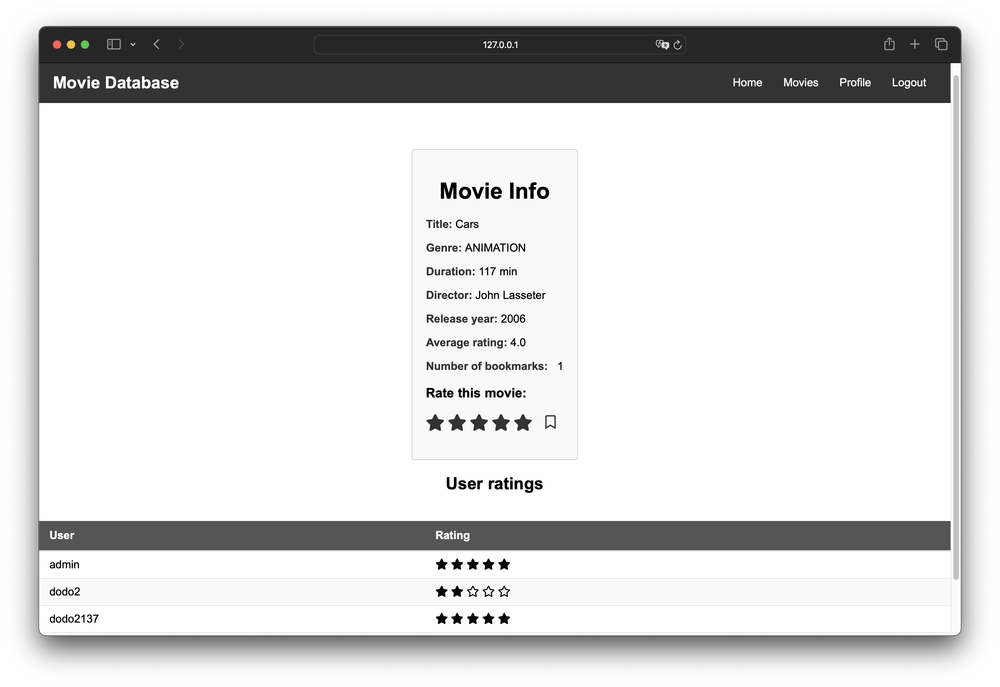
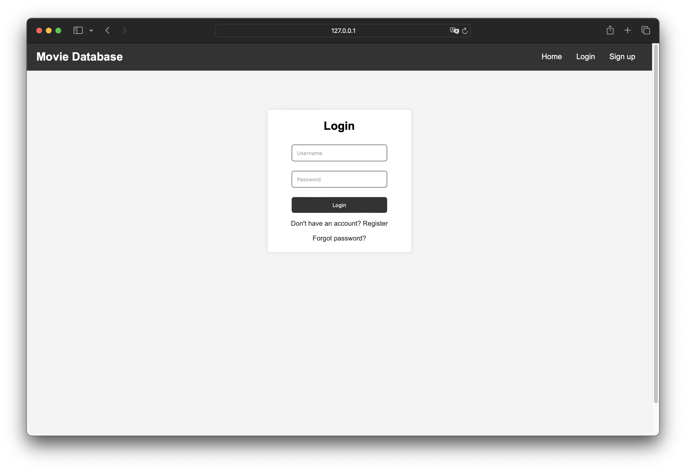
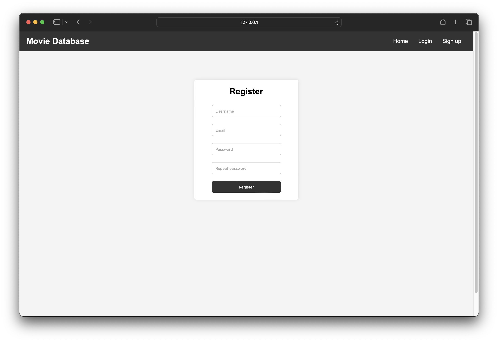

# Aplikacja Movie Database - projekt na wcześniejsze zaliczenie
Projekt został przygotowany przy pomocy biblioteki django oraz z wykorzystaniem HTML i CSS. Wszystkie użyte biblioteki zostały spisane w pliku requirements.txt. 
Składa się z 3 modeli: Movie, Rating i Bookmark. Pierwszy model zawiera infomacje o filmie, kolejne 2 infomację o ocenie oraz zakładce dla filmów.
## Strona główna

Strona główna składa się z navbara, na którym znajdują się odnośniki do poszczególnych podstron. Żeby mieć do nich dostęp użytkownik musi być zalogowany. W przeciwnym przypadku przyciski nie wyświetlą się i będzie jedynie dostęp do strony logowania lub rejestracji.  
Dodatkowo znajduje się panel z filmami na czasie. Są one wyświetlane na podstawie tabeli z ocenami użytkowników dla poszczególnych filmów. Klikając w tytuł filmu zostaniemy przeniesieni do strony z infomacjami na jego temat.

## Lista filmów

Po kliknięciu w przycisk movies zostaniemy przeniesieni na stronę z listą filmów. Zawiera one wszystkie filmy dodane do bazy danych. Jeżeli lista będzie zbyt długa, tabela zostanie podzielona na strony w celu łatwiejszego przeglądania. Filmy mogą być filtrowane przy pomocy dostępnego formularza. Każdy film może zostać dodany do zakładek użytkownika. Zakładki są przechowywane w specjalnej do tego tabeli.
Dla osób z rangą MovieEditor dostępny jest przycisk "Add movie", który przeniesie nas do strony z formularzem dodawania filmu.

## Profil użytkownika

Strona ta zawiera wszystkie informacje przechowywane na temat użytkownika. Tabela poniżej jest połączeniem tabel z zakładkami i ocenami. Przedstawia wystawione oceny i zakładki użytkownika. 

## Informacje o filmie

Strona z informacjami o filmie. Można dodać zakładkę i ocenę. Liczba zakładek się dynamicznie zmienia. Tabela ocen użytkowników.

## Logowanie, rejestracja i reset hasła

Po zalogowaniu/wylogowaniu przenosiemy się na stronę główną.  
Po wpisaniu maila w konsoli zostanie wypisana treść maila wzraz z linkiem do resetu hasła (jeśli mail był w bazie danych).
